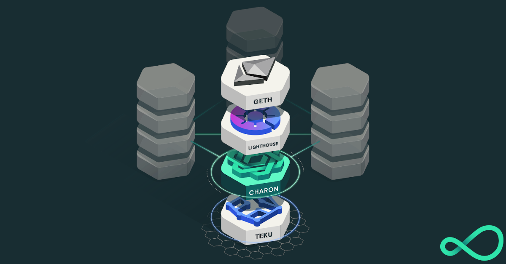

<h1 align="center">Charon Distributed Validator Node (Kubernetes)</h1>

This repo contains the [Kubernetes](https://kubernetes.io/) manifests needed to run one node in a [charon](https://github.com/ObolNetwork/charon) [Distributed Validator Cluster](https://docs.obol.tech/docs/int/key-concepts#distributed-validator-cluster).

A distributed validator node is a machine running:

- An Ethereum Execution client
- An Ethereum Consensus client
- An Ethereum Distributed Validator client
- An Ethereum Validator client



# Quickstart

The following instructions aim to assist a group of users coordinating together to create a distributed validator cluster between them. Only one person needs to do [step 2](#step-2-leader-creates-the-dkg-configuration-file-and-distributes-it-to-everyone-else) and [step 5](#step-5-activate-the-deposit-data) in the quickstart process.

## Pre-requisites

Ensure you have [docker](https://docs.docker.com/engine/install/) and [git](https://git-scm.com/downloads) installed. Also, make sure `docker` is running before executing the commands below.
Ensure you have a functional k8s cluster and [`kubectl`](https://kubernetes.io/docs/tasks/tools/#kubectl)

## Step 1. Creating and backing up a private key for charon

The first step of running a cluster is preparing for a distributed key generation ceremony. To do this everyone must create an [ENR](https://docs.obol.tech/docs/int/faq#what-is-an-enr) for their charon client. This ENR is a public/private key pair, and allows the other charon clients in the DKG to identify and connect to your node.

```sh
# Clone this repo
git clone https://github.com/ObolNetwork/charon-k8s-distributed-validator-node.git

# Change directory
cd charon-k8s-distributed-validator-node

# Create your charon ENR private key, this will create a charon-enr-private-key file in the .charon directory
docker run --rm -v "$(pwd):/opt/charon" obolnetwork/charon:v0.17.0 create enr
```

You should expect to see a console output like

    Created ENR private key: .charon/charon-enr-private-key
    enr:-JG4QGQpV4qYe32QFUAbY1UyGNtNcrVMip83cvJRhw1brMslPeyELIz3q6dsZ7GblVaCjL_8FKQhF6Syg-O_kIWztimGAYHY5EvPgmlkgnY0gmlwhH8AAAGJc2VjcDI1NmsxoQKzMe_GFPpSqtnYl-mJr8uZAUtmkqccsAx7ojGmFy-FY4N0Y3CCDhqDdWRwgg4u

> ⚠️ Attention
>
> Please make sure to create a backup of the private key at `.charon/charon-enr-private-key`. Be careful not to commit it to git! **If you lose this file you won't be able to take part in the DKG ceremony.**

If you are taking part in an organised Obol testnet, submit the created ENR public address (the console output starting with `enr:-...` not the contents of the private key file) to the appropriate typeform.

## Step 2. Leader creates the DKG configuration file and distributes it to everyone else

One person, in the cluster or otherwise, will prepare the `cluster-definition.json` file for the distributed key generation ceremony using the `charon create dkg` command. For the official Obol testnets, this step will be completed by an Obol core team member or the cluster captain and the definition file will be distributed to the cluster members for DKG completion.

In future, step 1 and step 2 of this guide will use the [Obol Distributed Validator Launchpad](https://docs.obol.tech/docs/dvk/distributed_validator_launchpad) to facilitate and verify these files are created in an authenticated manner.

```
# Prepare an environment variable file
cp .env.create_dkg.sample .env.create_dkg

# Populate the .env.create_dkg file with the cluster name, the fee recipient and withdrawal Ethereum addresses and the 
# operator ENRs of all the operators participating in the DKG ceremony.

# Run the `charon create dkg` command that generates DKG cluster-definition.json file.
docker run --rm -v "$(pwd):/opt/charon" --env-file .env.create_dkg obolnetwork/charon:v0.17.0 create dkg
```

This command should output a file at `.charon/cluster-definition.json`. This file needs to be shared with the other operators in a cluster.

## Step 3. Run the DKG

After receiving the `cluster-definition.json` file created by the leader, cluster members should ideally save it in the `.charon/` folder that was created during step 1, alternatively the `--definition-file` flag can override the default expected location for this file.

Every cluster member then participates in the DKG ceremony. For Charon v1, this needs to happen synchronously between participants at an agreed time.

```
# Participate in DKG ceremony, this will create .charon/cluster-lock.json, .charon/deposit-data.json and .charon/validator_keys
docker run --rm -v "$(pwd):/opt/charon" obolnetwork/charon:v0.17.0 dkg
```

Assuming the DKG is successful, a number of artefacts will be created in the `.charon` folder. These include:

- A `deposit-data.json` file. This contains the information needed to activate the validator on the Ethereum network.
- A `cluster-lock.json` file. This contains the information needed by charon to operate the distributed validator cluster with its peers.
- A `validator_keys/` folder. This folder contains the private key shares and passwords for the created distributed validators.

At this point you should make a backup of the `.charon/validator_keys` folder as replacing lost private keys is not straightforward at this point in charon's development. The `cluster-lock` and `deposit-data` files are identical for each operator and can be copied if lost.

If taking part in the official Athena testnet, one cluster member will have to submit the `cluster-lock` and `deposit-data` files to the Obol Team, setting the stage for activation.

## Step 4. Start the Distributed Validator Node

With the DKG ceremony over, the last phase before activation is to prepare your node for validating over the long term.

### Prepare charon node environment variables file
```
cp .env.sample .env
```
Populate the .env file with the cluster name, charon versions, teku version, beacon nodes comma separated list, and monitoring token.

### Deploy Charon Node
```
./deploy-node.sh <node_name> # Please ensure you replace `<node_name>` with the name of your node.
```

To turn off your node after checking the health of the node you can run:
```
kubectl delete ns $NAMESPACE
```

## Step 5. Activate the deposit data

If you and your team have gotten to this phase of the quickstart, and you have successfully created a distributed validator together, and you have connected all of your charon clients together such that the monitoring indicates that they are all healthy and ready to operate, one person may process to activate this deposit data with the existing [staking launchpad](https://prater.launchpad.ethereum.org/).

This process can take a minimum of 16 hours, with the maximum time to activation being dictated by the length of the activation queue, which can be weeks. You can leave your distributed validator cluster offline until closer to the activation period if you would prefer. You can also use this time to improve and harden your monitoring and alerting for the cluster.

If you have gotten this far through the process, and whether you succeed or fail at running the distributed validator successfully on the testnet, we would like to hear your feedback on the process and where you encountered difficulties. Please open issues in either this repo if the problem is deployment related, or the [charon](https://github.com/ObolNetwork/charon) repo if the issue is directly related to the client.

# Other Actions

The above steps should get you running a distributed validator cluster. The following are some extra steps you may want to take either to help Obol with their testing program, or to improve the resilience and performance of your distributed validator cluster.

## Step 6. Leader Adds Central Monitoring Token

The cluster leader will be provided with a Central Monitoring Token used to push distributed validator metrics to our central prometheus service to monitor, analyze and improve your cluster's performance. The token needs to be added in prometheus/prometheus.yml replacing `$PROM_REMOTE_WRITE_TOKEN`. The token will look like:
`eyJtZXNzYWdlIjoiSldUIFJ1bGVzISIsImlhdCI6MTQ1OTQ0ODExOSwiZXhwIjoxNDU5NDU0NTE5fQ`. 
Final prometheus/prometheus.yml would look something like:
```
global:
  scrape_interval:     30s # Set the scrape interval to every 30 seconds.
  evaluation_interval: 30s # Evaluate rules every 30 seconds.

remote_write:
  - url: https://vm.monitoring.gcp.obol.tech/write
    authorization:
      credentials: eyJtZXNzYWdlIjoiSldUIFJ1bGVzISIsImlhdCI6MTQ1OTQ0ODExOSwiZXhwIjoxNDU5NDU0NTE5fQ

scrape_configs:
  - job_name: 'charon'
    static_configs:
      - targets: ['charon:3620']
  - job_name: 'teku'
    static_configs:
      - targets: ['teku:8008']
  - job_name: 'node-exporter'
    static_configs:
      - targets: ['node-exporter:9100']
```
# Project Status

It is still early days for the Obol Network and everything is under active development.
It is NOT ready for mainnet.
Keep checking in for updates, [here](https://github.com/ObolNetwork/charon/#supported-consensus-layer-clients) is the latest on charon's supported clients and duties.

# FAQs:

See the [FAQ](https://docs.obol.tech/docs/int/faq/general) section of our docs for troubleshooting and other general inquiries.
